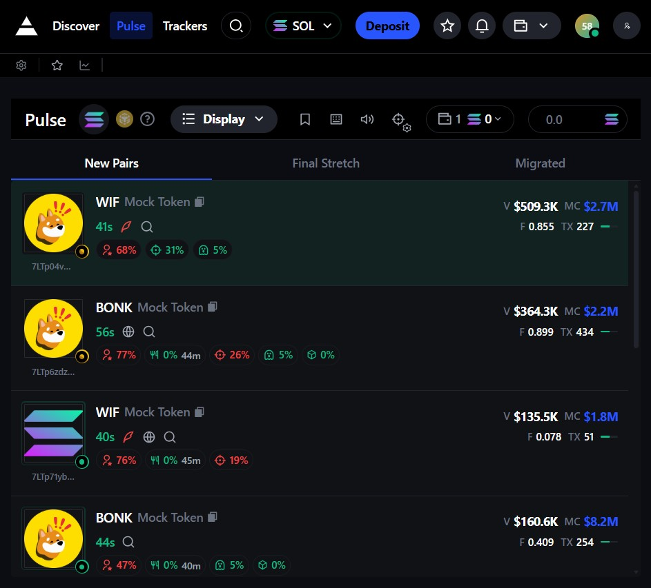

# ⚡ Pulse Crypto Dashboard


> **A high-performance, pixel-perfect crypto trading dashboard built for speed and usability.**

This project features a real-time token board, complex interactive overlays, and a robust modal ecosystem, all architected using **Atomic Design principles**.

---

## 📸 Preview

| **Desktop View** | **Mobile View** |
|:---:|:---:|
|  |  |
| *Panoramic 3-column layout* | *Optimized touch interactions* |

[**🔴 View Live Demo**](https://axiom-pulse-clone-two.vercel.app/) · [**🐛 Report Bug**](https://github.com/Manideep-422105/axiom-pulse-clone) ·
---

## 🚀 Features

### 📊 Interactive Token Board
* **Multi-Column Layout:** Seamlessly switch between *New Pairs*, *Final Stretch*, and *Migrated*.
* **Responsive Design:** Intelligent shifting from a desktop 3-column grid to mobile tabbed navigation.
* **Shimmer Loading:** Polished Skeleton loaders prevent layout shifts during data fetching.

### 🃏 Advanced Token Cards
* **Dual-View Architecture:**
    * *Normal:* Price, Market Cap, Volume, Holders.
    * *Hover:* Expanded metrics, socials, and contract addresses.
* **Quick Actions:** One-click "Quick Buy" and Clipboard copy with Toast notifications.
* **Visual Indicators:** Protocol badges (Pump/Meteora), Audit flags, and Holder concentration warnings.

### 🎛️ Modal Ecosystem
The application uses **React Portals** to manage a complex layer of overlays:
* **Display:** Toggle columns, adjust density, and save layout preferences.
* **Snipe Settings:** Configure Slippage, Priority Fees, Bribery, and MEV Protection.
* **Hotkeys:** Visual manager to view and configure keyboard shortcuts.
* **Alerts:** Volume control and sound toggle management.

---

## 🛠️ Tech Stack

| Category | Technology | Description |
| :--- | :--- | :--- |
| **Framework** | Next.js (React) | App Router architecture |
| **Styling** | Tailwind CSS | Pixel-perfect utility classes |
| **State** | Redux Toolkit | Global state management for modals/data |
| **Language** | TypeScript | Strictly typed for reliability |
| **Icons** | Remix Icons | Via React Icons |

---

## 📂 Project Structure

This project follows **Atomic Design** principles to ensure scalability.

```text
src/
├── components/
│   ├── atoms/             # Basic building blocks (Buttons, Inputs, Icons)
│   ├── molecules/         # Simple combinations (Search bars, Dropdowns)
│   └── organisms/         # Complex sections (Global Header, Footer)
├── modules/
│   └── pulse/             # Feature-specific logic
│       ├── components/
│       │   ├── molecules/ (TokenCard, Skeleton, Headers)
│       │   └── organisms/ (TokenBoard, Modals)
├── hooks/                 # Custom React hooks
├── store/                 # Redux slices & store configuration
└── utils/                 # Mock data & helper functions
```

## 🚦 Getting Started

```text
Prerequisites
- Node.js v18 or higher
- npm or yarn
```

```bash
git clone https://github.com/your-username/pulse-dashboard.git
cd pulse-dashboard
```

```bash
npm install
# or
yarn install
```

```bash
npm run dev
# or
yarn dev
```

```text
Open browser:
http://localhost:3000
```

---

## 🎨 Customization

```text
Theming
- Tailwind CSS configuration: tailwind.config.ts
- Backgrounds: bg-background, bg-backgroundSecondary
- Text: text-textPrimary, text-textTertiary
- Accents: text-primaryBlue, text-primaryGreen
```

```text
Mock Data
- File: src/utils/mockData.ts
- Modify token names, prices, volume, generation logic
```

---

## 📸 Screenshots

```text
Desktop View
- Panoramic 3-column layout
```


```text
Mobile View
- Tab-based column switching
- Optimized touch interactions
```


- Real-time updates
```

```text
Settings Modals
- Snipe Settings
- Display Preferences
- Alerts Configuration
```
